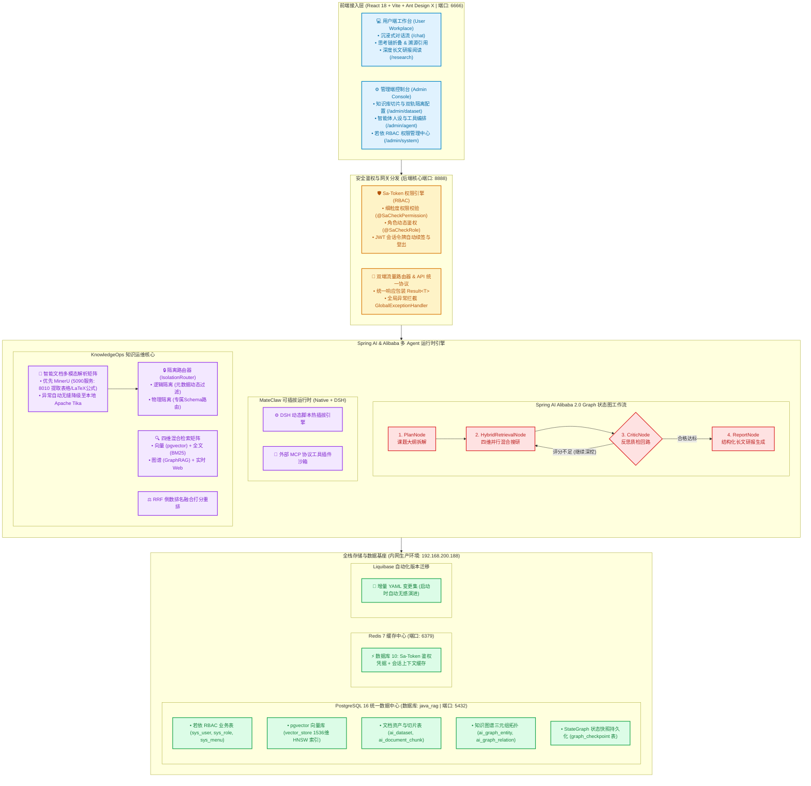

# Java RAG + Agent 平台业务架构与系统设计白皮书 (readme-业务.md)

> **核心定位**：基于 **Spring AI 2.0 + Spring AI Alibaba 2.0 (Graph 状态图引擎)** 构建的新一代企业级认知中枢与多 Agent 协同平台。  
> 融合 **若依标准 RBAC 权限体系**、**全栈 PostgreSQL 16 统一数据基座**、**MateClaw 可插拔运行时 (Native + DSH)**、**KnowledgeOps 知识运维** 与 **RAG 双轨安全隔离体系**。

---

## 一、系统总体架构框架图 (System Architecture Diagram)



---

## 二、六大核心业务流程与逻辑详解

### 1. 业务逻辑一：前端“双端分离”与权限流转
- **设计理念**：彻底打破传统企业软件“一个中后台走天下”的臃肿弊端，借鉴 Dify / FastGPT 顶尖实践，区分用户视角与管理视角。
- **业务流程**：
  1. 用户在登录页登录后，系统通过 Sa-Token 返回 JWT Token 并提取用户的角标与权限集合；
  2. **普通员工**：登录后默认进入 **用户工作台 (`UserLayout`)**，直达 `/chat`。界面无复杂的管理侧边栏，仅保留极简的会话历史列表，专注高效问答、思维链查看与研报阅读；
  3. **管理员角色**：进入用户工作台时，页面右上角会通过权限计算自动唤起 **【⚙️ 管理控制台】** 入口；点击可无缝跳转至 `/admin/dataset`；
  4. **管理端视角 (`AdminLayout`)**：左侧提供经典的若依风格树形菜单，支持管控知识资产与系统设置；顶部常驻 **【💬 返回用户工作台】** 胶囊，管理员可随时切回业务第一线体验 Agent 回复质量；
  5. **安全拦截机制**：若普通用户直接输入 `/admin/*` 路径，前端路由守卫联动后端 Sa-Token 注解 `@SaCheckRole("admin")` 实施双重拦截，返回 403 无权访问。

---

### 2. 业务逻辑二：RAG 逻辑隔离 与 物理隔离 双轨架构
- **业务诉求**：企业知识资产包含不同安全等级（如：普通培训手册 vs 商业机密核心代码/财务绝密报表），必须兼顾资产共享与严防越权泄密。
- **双轨架构执行流**：
  ```
  上传文档 ──► 设定安全策略
                 ├─► [策略A: 逻辑隔离 (LOGICAL)] ──► 写入共享表 (打上 roles/密级标签) ──► 检索时 FilterExpression 过滤
                 └─► [策略B: 物理隔离 (PHYSICAL)] ──► 动态路由至专属 Schema (如 isolated_sec_01) ──► 强制走局域网私有模型
  ```
  1. **逻辑隔离 (Logical Isolation)**：
     - 面向公开与部门级资料（密级 1~2）；
     - 文档切片统一存入全量共享表 `ai_document_chunk`，切片元数据打上 `dataset_id`、`accessible_roles`、`security_level` 标签；
     - 检索查询时，后端 `IsolationRouter` 自动读取当前登录员工的 Sa-Token 角色集合，向 Spring AI 注入元数据动态过滤表达式，非授权切片物理不可查。
  2. **物理隔离 (Physical Isolation)**：
     - 面向核心绝密资产（密级 3）；
     - 触发物理隔离时，系统在 PostgreSQL 中自动为其分配或创建专属的独立 Schema（例如 `isolated_sec_core`）；
     - 数据存储、向量索引彻底物理割裂；且在向量检索与推理阶段，系统**强制限定仅允许调用内网私有化部署的大模型**，严防绝密数据包外流至公网大模型厂商。

---

### 3. 业务逻辑三：KnowledgeOps 四维混合检索与 RRF 打分重排
- **业务诉求**：解决传统单一向量检索“关键词命中不准”、“行业专业实体关系割裂”、“缺少实时资讯”的固有缺陷。
- **四维混合检索矩阵**：
  1. **稠密向量路 (Dense)**：基于 pgvector 的 1536 维 HNSW 索引计算余弦距离（Cosine Similarity），召回语义泛化相关段落；
  2. **稀疏关键词路 (Sparse)**：利用 PostgreSQL 全文检索 / BM25 词频匹配，精准定位专有名词、产品编码、错误代码；
  3. **知识图谱拓扑路 (GraphRAG)**：提取 `ai_graph_entity` 与 `ai_graph_relation` 三元组关系，向上追溯上下游依赖实体（如“系统A”依赖“数据库B”）；
  4. **实时互联网资讯路 (Web Search)**：针对突发资讯、外部政策与实时开源项目，并发调用互联网搜索引擎获取最新事实。
- **RRF (Reciprocal Rank Fusion) 倒数排名融合算法**：
  $$RRF\_Score(d) = \sum_{m \in M} \frac{w_m}{k + Rank_m(d)}$$
  对四路候选结果根据名次与权重进行科学打分合并，截取 Top-K 形成精准的上下文送入 LLM。

---

### 4. 业务逻辑四：Spring AI Alibaba Graph 深度搜研多 Agent 状态机
- **状态图流转拓扑**：
  ```
  [START] ──► PlanNode (拆解为多维研究子任务大纲)
                  │
                  ▼
              HybridRetrievalNode (四维并发混合搜研获取证据)
                  │
                  ▼
              CriticNode (质检打分: 事实性、充实度、逻辑性)
                  ├── [评分 < 80 且重试 < 3次] ──► (回路回退至 HybridRetrievalNode 继续补全证据)
                  └── [评分 ≥ 80 或达到上限]  ──► ReportNode (综合多维事实撰写长篇技术研报)
                                                      │
                                                      ▼
                                                    [END]
  ```
- **PostgresCheckpointer 断点持久化机制**：
  - 每个 Node 执行完成后，状态机通过 `PostgresCheckpointer` 将全局状态快照序列化为 JSON 写入 `graph_checkpoint` 表；
  - 研报编写中途若遭遇断电、服务重启或网络闪断，系统能够直接从最新检查点无损继续执行，无需从头重跑。

---

### 5. 业务逻辑五：MateClaw 可插拔运行时 (Native + DSH)
- **业务诉求**：智能体能力不能硬编码在代码里，需要能够根据业务需求随时插拔新工具、新脚本与 MCP (Model Context Protocol) 插件。
- **核心能力**：
  1. **Native 原生工具**：系统内置开箱即用的知识检索、计算器、天气、若依系统操作日志审计等组件；
  2. **DSH 动态脚本热插拔引擎**：允许管理员在管理后台在线编写 Groovy / Python / JS 等轻量脚本，无需重启后端服务即可动态装载为智能体的新工具；
  3. **沙箱防护机制**：对热插拔脚本实施内存超限熔断、死循环拦截与无特权执行保护。

---

### 6. 业务逻辑六：Liquibase 自动化版本演进机制 (借鉴 kumhosunny-admin-basic)
- **规范体系**：
  - 禁止在任何环境手工执行 SQL 脚本修改数据库；
  - 所有数据库结构的演进收敛在 `backend/src/main/resources/db/changelog/` 目录下；
  - 每次新增功能或增加字段，仅需新增一个以序号命名的 YAML 文件（如 `04_add_user_dept.yaml`），并在 `db.changelog-master.yaml` 引入；
  - 应用启动时，Liquibase 自动检查 `databasechangelog` 表，未执行的 changeset 会按顺序执行并打上版本指纹，保障全团队与生产环境 100% 同步。

---

## 三、网络拓扑与端口配置矩阵

| 模块 | 部署端口 | 访问 URL | 核心职能 |
| :--- | :--- | :--- | :--- |
| **前端用户端 (User)** | `6666` | `http://localhost:6666/chat` | 沉浸式多轮智能体问答、思维链查看、深度长文研报阅读 |
| **前端管理端 (Admin)** | `6666` | `http://localhost:6666/admin/dataset` | 知识库管理、双轨隔离配置、智能体编排、若依 RBAC 权限字典 |
| **后端 API 服务** | `8888` | `http://localhost:8888/` | Spring AI 2.0 + Alibaba Graph 核心引擎业务接口 |
| **后端在线接口文档** | `8888` | `http://localhost:8888/doc.html` | Knife4j OpenAPI 3 在线交互与调试中心 |
| **PostgreSQL 数据中心** | `5432` | `192.168.200.188:5432/java_rag` | RBAC业务表、pgvector 向量库、知识图谱、Checkpoint快照 |
| **Redis 缓存中心** | `6379` | `192.168.200.188:6379 (DB 10)` | Sa-Token 分布式登录凭据与 Chat Memory 对话记忆缓存 |
| **MinerU 多模态解析服务** | `8010` | `http://192.168.100.90:8010/file_parse` | 5090 专属多模态引擎，高精度提取复杂排版、LaTeX公式与表格 |
| **LLM 驱动网关** | `443` | `https://apihub.agnes-ai.com` | 默认基模: `agnes-2.5-flash`，兼容 OpenAI 规范 |

---

## 四、极速启动指南

### 1. 启动后端服务 (端口: 8888)
```bash
cd backend
mvn spring-boot:run
```
启动成功后控制台将格式化打印出完整的欢迎 Banner 与前后端快捷访问地址。

### 2. 启动前端服务 (端口: 6666)
```bash
cd frontend
npm run dev
```
启动后在浏览器打开：`http://localhost:6666`  
- **默认管理员账号**：`admin`  
- **默认管理员密码**：`admin123`
